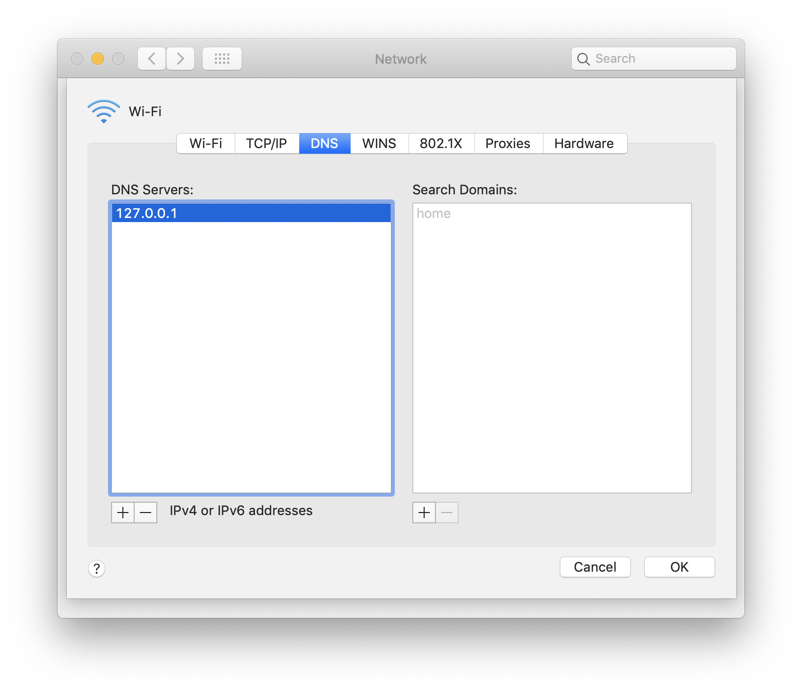

To run the manual tests for SRV polling there's a bit of setup. You need:
1. a DNS server
2. a sharded cluster with multiple mongoses running with TLS
3. some way to observe the scanning behavior

## Step 1: A local DNS server ##
You can start a local DNS server easily with a python module called dnslib:
```
pip install dnslib
```

You configure it with a "zone" file which contains the DNS records. There is one in this repository:
```
python -m dnslib.zoneresolver --zone dns.zone
```

Then, you can test it out using a DNS lookup utility like `dig`:
```
dig -t srv _mongodb._tcp.server.mongodb.com @localhost
```

And the response should have an "answer" with the host:
```
;; ANSWER SECTION:
_mongodb._tcp.server.mongodb.com. 1 IN	SRV	0 5 27018 mongodb1.mongodb.com.
```

Next, to test this locally, set your default DNS to point to this local server. On macOS you can instruct it to be used as the default DNS server by going to "System Preferences" => "Network" => "Advanced" => "DNS", and adding an entry for "127.0.0.1"

Be careful though. This overrides the default DNS lookup and renders you offline. Remove this entry after testing.

## Step 2: A sharded cluster ##
You'll need four mongoses for the tests, and TLS configured. The client/server pem files are included in this repo.

```
mlaunch init --replicaset --nodes=1 --sharded=1 --mongos 4 --hostname localhost --setParameter enableTestCommands=1 --setParameter="logComponentVerbosity={command:3}" --tlsMode=allowTLS --tlsCertificateKeyFile=server.pem --tlsCAFile=ca.pem --tlsAllowConnectionsWithoutCertificates --dir ./srv-sharded
```

## Step 3: Running tests and observing ##
The simplest (though hacky) way is to modify the C driver and example-client.
- Set MONGOC_TOPOLOGY_MIN_RESCAN_SRV_INTERVAL_MS to 1000 in mongoc-topology-private.h (since the DNS records have TTL of 1 second, this means a scan will occur every second, instead of every 60 seconds).
- Copy example-client-modified.c from this repo over example-client.c. This modified example-client prints the host list every second after running a find command for 60 seconds total.
- Run example-client
    - The first argument is the URI. Passing a URI with TLS options (just use tlsinsecure since TLS isn't what we're testing). Set heartbeatFrequencyMS to 1000 so scanning happens every second. And if the initial SRV lookup resolves to one host the topology description will enter "Single" and polling will be bypassed. Pass `directConnection=false` to prevent this.
    - The second argument is either SINGLE or POOLED to test single or pooled client monitoring. Test each scenario.
```
./cmake-build/src/libmongoc/example-client "mongodb+srv://server.mongodb.com/?tls=true&tlsinsecure=true&heartbeatFrequencyMS=1000&directConnection=false" SINGLE
```

If all goes well, you'll see a printout of all known hosts every second. This will happen for 60 seconds. You can kill the DNS server and restart it with different records to test the different scenarios.

- As a bonus, build example-client with the C flag `-fsanitize=address` and set the following environment variables:
    - `export ASAN_OPTIONS='detect_leaks=1'`
    - `export LSAN_OPTIONS='suppressions=.lsan-suppressions'`
    This will do leak detection.
